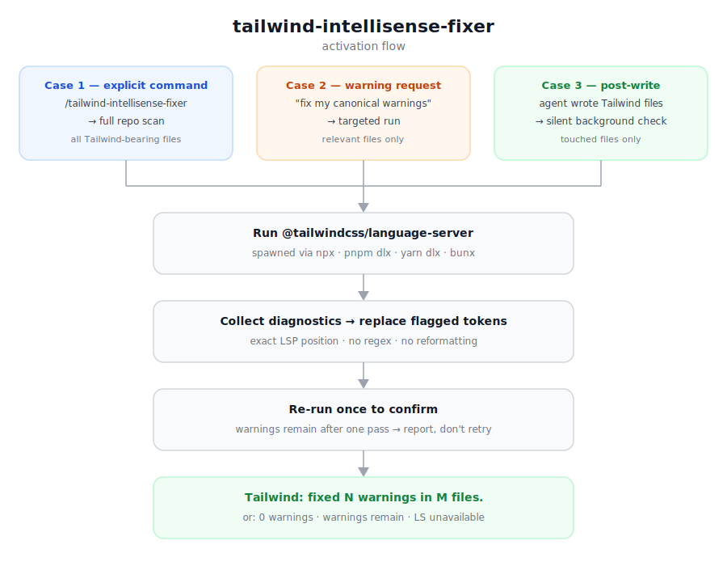

<div align="center">

<h1>tailwind-skills</h1>

<p><strong>Tailwind CSS agent skills</strong></p>

<p>
  
  
  
</p>

</div>

A collection of skills for Tailwind CSS — fixes canonical class warnings using the live language server, maybe more Tailwind tooling to come.

---

## Skills

### tailwind-intellisense-fixer

Fixes Tailwind CSS `suggestCanonicalClasses` warnings using the live `@tailwindcss/language-server`.

Tailwind v4 tightened what counts as canonical — and agents write a lot of non-canonical forms because they have no IntelliSense feedback while generating code. The result is a pile of yellow squiggles after every session that you'd otherwise need to clean up with a separate tool (`@tailwindcss/upgrade`, an ESLint plugin, etc.) outside the agent session.

This skill fixes them inside the agent session, on demand or automatically after the agent edits your files.

It opens a real LSP session, collects diagnostics, and replaces only the flagged tokens — no regex guessing.



---

## Installation

```bash
npx skills add https://github.com/AdriBarda/tailwind-skills --skill tailwind-intellisense-fixer
```

The skill requires `@tailwindcss/language-server` to be resolvable by your project's package manager (npm, pnpm, yarn, or bun). It does **not** need to be listed in `dependencies` — it resolves on demand via `npx`/`pnpm dlx`/`yarn dlx`/`bunx`.

---

## How it activates

### Case 1 — explicit command

Invoke `/tailwind-intellisense-fixer` directly (with or without trailing text).  
→ Full repo scan across all Tailwind-bearing files.

### Case 2 — warning remediation request

Tell your agent you're seeing canonical class warnings or ask it to fix them.  
→ Targeted diagnostics run, warnings fixed, final status reported.

### Case 3 — post-write background check

Agent just wrote or edited files in a Tailwind CSS project.  
→ Automatically checks only the touched files and appends a one-line status footer.

Everything else — general Tailwind questions, read-only reviews, non-Tailwind projects — does not trigger the skill.

---

## Output format

**Cases 1 & 2** (explicit, informative):

```
Tailwind: fixed 3 warnings in 2 files.
Tailwind: 0 warnings across 4 files — all clean.
Tailwind: 2 warnings remain — src/Card.tsx:12 "shadow" → "shadow-sm"
Tailwind: language server unavailable — <error>
  Ensure @tailwindcss/language-server is resolvable via your package manager.
```

**Case 3** (background, one line only):

```
Tailwind: fixed 3 warnings in 2 files.
Tailwind: 0 warnings.
Tailwind: 2 warnings remain — src/Card.tsx:12 message
Tailwind: LS unavailable — skipped.
```

---

## Architecture

```
skills/tailwind-intellisense-fixer/
├── SKILL.md                     — skill definition read by the coding agent
└── bin/
    ├── tailwind-scan.mjs        — discovers Tailwind files, delegates to diagnostics
    └── tailwind-diagnostics.mjs — opens an LSP session, collects and returns diagnostics
```

`tailwind-diagnostics.mjs` spawns `@tailwindcss/language-server` via your package manager, does a minimal LSP handshake, opens the target files, waits for diagnostics to settle, then kills the server and returns JSON. No persistent process, no config changes.

`tailwind-scan.mjs` discovers candidate files via ripgrep (Node.js fallback) and passes them to `tailwind-diagnostics.mjs`. Skips `node_modules`, `.next`, `dist`, `build`, `coverage`.

---

## Requirements

| Requirement                    | Notes                                                                                               |
| ------------------------------ | --------------------------------------------------------------------------------------------------- |
| Node.js                        | Any version that supports ESM (`node:` imports)                                                     |
| Package manager                | npm, pnpm, yarn, or bun — used to resolve the language server                                       |
| `@tailwindcss/language-server` | Resolved on demand, not required in `dependencies`                                                  |
| Tailwind CSS project           | Must have `tailwindcss` in `package.json`, a `tailwind.config.*`, or `@import "tailwindcss"` in CSS |

---

## Limitations and current state

**Experimental — trigger reliability is not stable.** Case 3 (post-write auto-trigger) depends on the agent's in-context judgment about whether the touched files contain Tailwind-bearing code. This is inconsistent across model versions and prompt shapes. Cases 1 and 2 (explicit triggers) are reliable.

**Only fixes `suggestCanonicalClasses`.** This is the one diagnostic code the skill targets. Other Tailwind IntelliSense warnings (unknown classes, invalid variants, deprecated utilities) are not touched.

**Surgical edits only — no second pass.** The skill replaces exactly the tokens named by diagnostics and re-runs once to confirm. If warnings remain after one fix pass, they are reported but not retried.

**Language server cold-start.** Each run spawns a fresh LS process (8 s startup timeout, 15 s total). No persistent session. On large repos, Case 1 full-scan can take several minutes.

**Package manager required.** Projects with no detected package manager will fail with a clear error message.

**Tailwind v4 only.** Built and tested against `@tailwindcss/language-server` (Tailwind v4). Tailwind v3 is not tested and may behave differently.

---

## License

MIT
